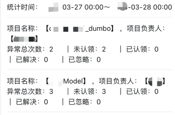

# 1.什么是ark-monitor-bug-repoter？
&emsp;&emsp;ark-monitor-bug-repoter是ark系列框架中的异常播报服务，用于线上异常报警场景。
###### 1）报警示例
 
###### 2）异常统计示例

# 2.ark-monitor-bug-repoter解决了什么问题？
&emsp;&emsp;当任何线上异常发生时，我们都可以通过ark-monitor-bug-repoter服务将异常信息及时的发送到钉钉群中，方便开发人员第一时间发现问题。
# 3.使用场景
- 线上发生异常时
# 4.功能列表
-  可追溯，增加报警信息当前的跟进状态，报警是否已解决等情况
-  界面清晰化，层次分明显示报警频次，状态，跟进人，负责人等信息
-  可一键查看异常日志详情，无需二次登录到查看
-  增加报警统计功能，每天统计前一天的报警次数及处理情况
# 5.服务如何启动？
- 修改配置文件并启动BugReportApplication

